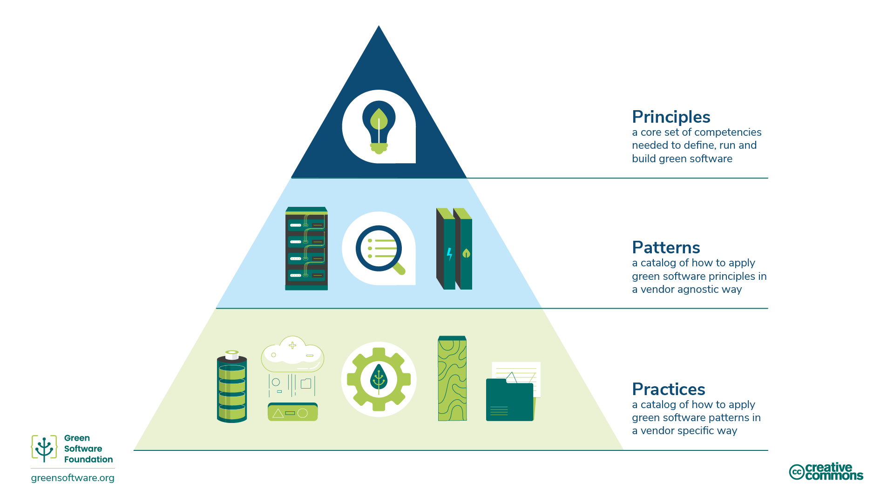

import TeamMember, { TeamMembers } from "@site/src/components/TeamMember";

# Green Software Patterns

  

 

## Summary

An online open-source database of software patterns reviewed and curated by the Green Software Foundation across a wide range of categories. You can be confident that applying any of our published and live patterns will reduce your software emissions.

Any software practitioner can find the patterns related to their field, technology, or domain. Anyone can submit a pattern that triggers a detailed review process by the Foundation.

## Getting Started

- Learn what constitutes a pattern and how to [contribute](/guide) a new one or edit an existing one.
- View the [catalog](/catalog/) of patterns.

## Quick Links

- [Press Release FAQ](https://github.com/Green-Software-Foundation/pr-faqs/blob/main/live/green-software-patterns.pr-faq.md)
- [Main Website](https://patterns.greensoftware.foundation)
- [Main GitHub Repository](https://github.com/Green-Software-Foundation/green-software-patterns)

## Principles, Patterns, and Practices

The [**principles**](https://learn.greensoftware.foundation/practitioner/introduction) of green software outline a core set of competencies needed to define, run and build green software.

A green software **pattern** is a specific example of how to apply one or more principles in a real-world example. Whereas principles describe the theory that underpins green software, patterns are the practical advice software practitioners can use in their software applications today. Patterns are vendor-neutral.

A green software **practice** is a pattern applied to a specific vendor's product and informs practitioners about how to use that product in a more sustainable way. 

Practices should refer to patterns that should refer to principles.

### Core Team

<TeamMembers>
  <TeamMember
    role="Project Manager"
    company="GSF"
    github="holanita"
  >
    Anita Holczmann
  </TeamMember>
  <TeamMember
    role="Project Lead"
    company="Microsoft"
    github="dubrie"
    twitter="dubrie"
    linkedin="dubrie"
  >
    Bill Johnson
  </TeamMember>
  <TeamMember
    role="Project Principle "
    company="Goldman Sachs"
    github="greenhsu123"
    twitter="greenhsu123"
    linkedin="greenhsu123"
  >
    Sarah Hsu
  </TeamMember>
</TeamMembers>

### Advisors

Advisors are associated with the project and may perform tasks related to the project.

<TeamMembers>
  <TeamMember
    role="Project Advisor"
    company="GSF"
    github="jawache"
    twitter="jawache"
    linkedin="jawache"
  >
    Asim Hussain
  </TeamMember>
  <TeamMember
    role="Project Advisor "
    company="GSF"
    github="osamajandali"
    twitter="osama_jandali"
    linkedin="osamajandali"
  >
    Osama Jandali
  </TeamMember>
</TeamMembers>
