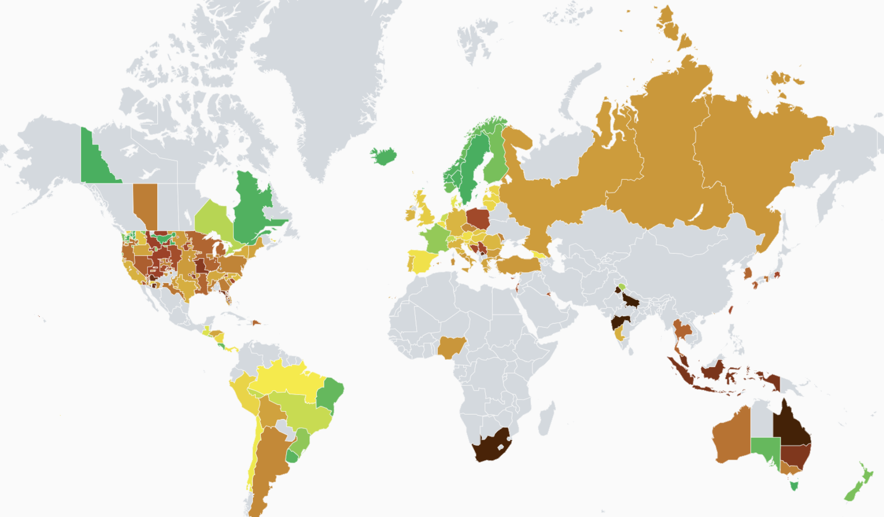

# Reduce carbon emissions of workloads, by deploying them to Regions or locations, where Electricity Carbon Intensity is low
## Version
1.0

## Submitted By
Yassine El Ghali (@yelghali)

## Published Date
TBD

## Intent
Reduce carbon emissions of workloads, by deploying them to Regions, or locations (Data Centers), where location-based marginal carbon emissions (aka Electricity Carbon Intensity), is low

## Tags
Cloud, Deployment, Compute, DevOps ; for Cloud Engineers; Complexity might be Large

## Problem
The carbon emissions of a software system depends on the power consumed by that sotware, but also on the Carbon intensity of the Electricity it is powered on. For this reason, running energy-efficient software on Carbon intensive Electtricity grid, might be inefficient to reduce its global carbon emissions. 

## Solution
Enable Carbon Aware, Region / Location shfting for workloads

## SCI Impact
`SCI = (E * I) + M per R`

Regarding the SCI equation. Reducing the distance will impact:

- `I`: The goal is to reduce SCI by reducing (I), and in practice, deploy workloads to Regions  / Locations, where (I) is low.

to capture the impact of Region shifting, the following image shows variation of Electricity Carbon Intensity for several countries, from one the Electricity providers, [ElectricityMap](https://app.electricitymaps.com/map).

## Assumptions
* the workloads can be scheduled to several Regions or Locations.
* the necessary Data travel is low to communicat with the workload in the distant region --> suitable for HPC worklaods, as they are compute extensive and require low data input.

## Pros & Cons
- **PRO**: Applications / workloads can benefit from Location shifting at the Platform Operating level, without requiring change to their code.
- **CON**: sovereignty & residency constraints, as well as technical difficulties (network communication, data travel..). 
